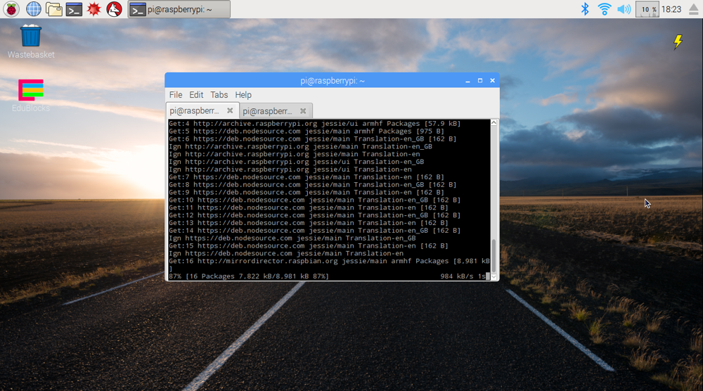
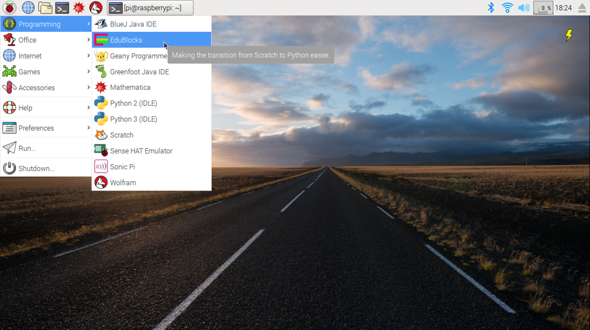

Welcome to the EduBlocks Github Repository
=========

About EduBlocks
---------------
EduBlocks is a visual block based programming tool that will hopefully help teachers to introduce text based programming languages, like Python, to children at an earlier age.

EduBlocks features:
* Block Format:
Easy and simple interface that uses a building block format to code.
* Extensive Documentation:
Lots of documentation to get you ready to go quickly. New projects added every 2 weeks.
* Range of libraries:
EduBlocks has a range of libraies like EduPython, Minecraft & Sonic Pi. (COMING SOON: GpioZERO, Sense Hat)
* Python View:
Once you have coded the blocks, you can easily switch to the Python View to see the real Python code.

Installation
------------
Get started with EduBlocks on your Raspberry Pi in these simple steps:

1. Open up a terminal window by clicking on the terminal icon on the top right hand corner of your Raspberry Pi's Screen

2. Type the following command and then press enter on your keyboard.
```bash
curl -sSL edu.buz.co | bash
```

3. When promted by the installer, press enter to select YES to install.

4. The installer will now run for a few minutes. This depends on your internet speeds.

5. You will now be able to see EduBlocks in the Raspberry Pi >> Programming menu. Click on the EduBlocks link to run the program.

6. After around half a minute, you should be able to see the EduBlocks workspace. Happy Coding.


Did this not work for you? Look at the Support section of this document.

Support
-------

Need help or support with EduBlocks? There are a few ways in which you can get in touch with us. We try our best to provide a speedy and smooth support service for our users. It may take us a few hours to respond as EduBlocks is not our full time jobs/ commitment. Also, it may take a few days/weeks/months before your request is solved.

###Twitter

EduBlocks Support: @edu_blocks
All About Code: @all_about_code

###Email

Support Email: support@edublocks.org
Joshua Email: josh@edublocks.org
Chris (Developer) Email: chris@edublocks.org

###Website

EduBlocks: http://edublocks.org
All About Code: http://allaboutcode.co.uk

Why GitHub?
-----------


