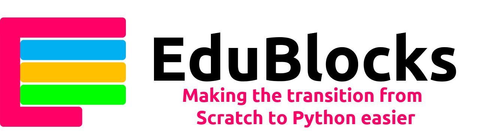
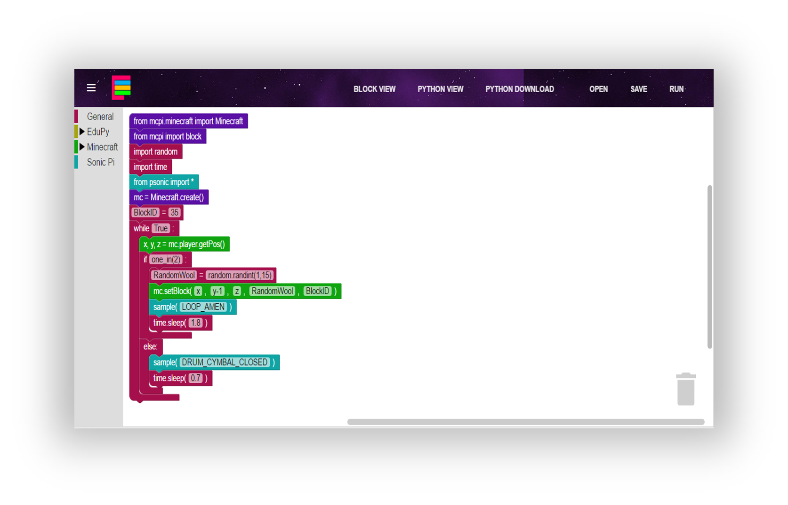
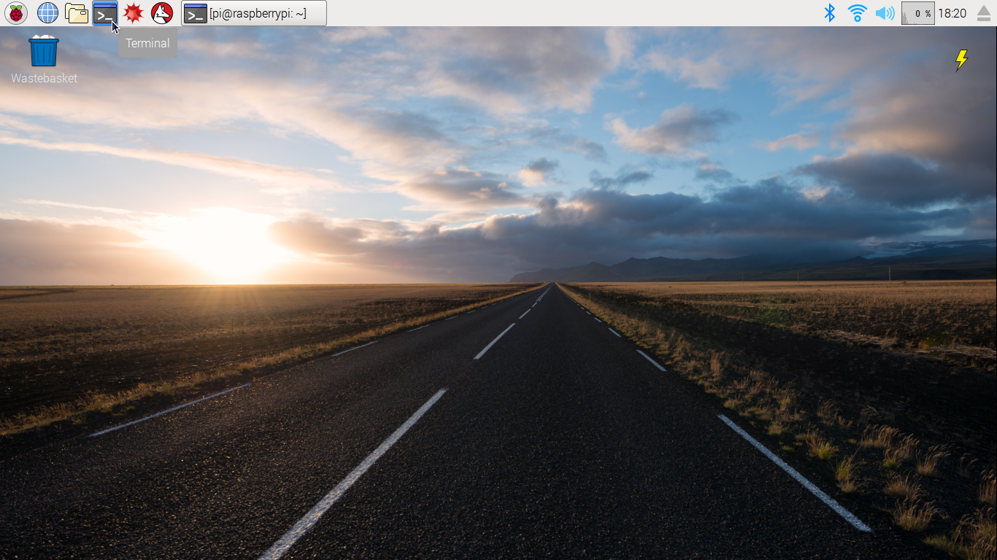
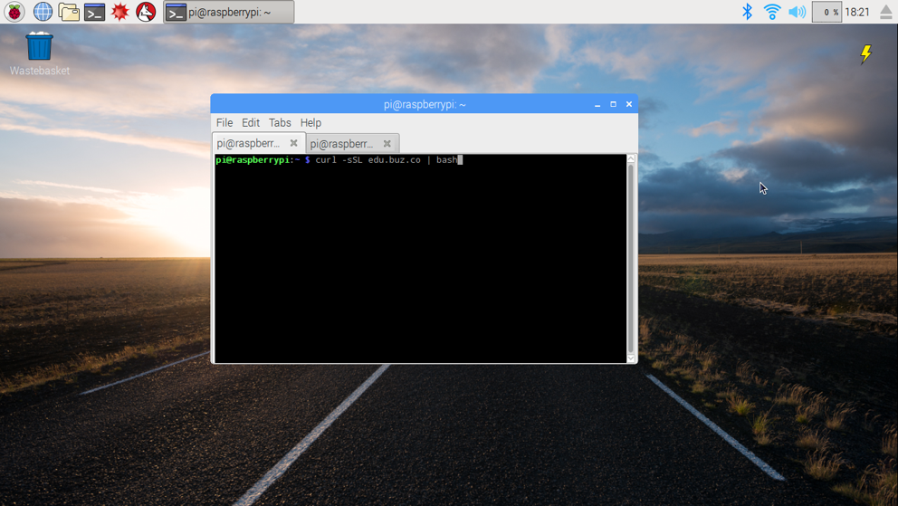
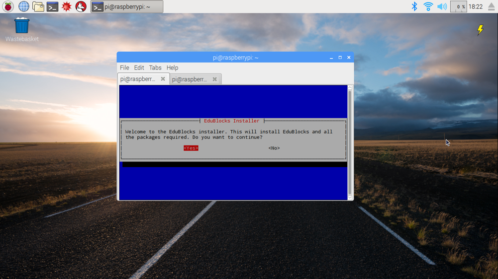

Welcome to the EduBlocks Github Repository
=========

About EduBlocks
---------------
EduBlocks is a visual block based programming tool that will hopefully help teachers to introduce text based programming languages, like Python, to children at an earlier age.

EduBlocks features:
* Block Format:
Easy and simple interface that uses a building block format to code.
* Extensive Documentation:
Lots of documentation to get you ready to go quickly. New projects added every 2 weeks.
* Range of libraries:
EduBlocks has a range of libraies like EduPython, Minecraft & Sonic Pi. (COMING SOON: GpioZERO, Sense Hat)
* Python View:
Once you have coded the blocks, you can easily switch to the Python View to see the real Python code.

Installation
------------
Get started with EduBlocks on your Raspberry Pi in these simple steps:

1. Open up a terminal window by clicking on the terminal icon on the top right hand corner of your Raspberry Pi's Screen

2. Type the following command and then press enter on your keyboard.
```bash
curl -sSL edu.buz.co | bash
```

3. When promted by the installer, press enter to select <YES> to install.



